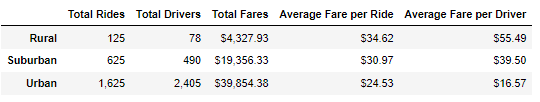

# PyBer Analysis

## PyBer Analysis Overview
We are working with PyBer, a Python-based ride-sharing app company, and we are analyzing large data sets with information regarding total fares and number of riders and drivers by city type. The analysis and visualizations that we conduct, will help Management to improve the Company's services and profitability.

In this specific analysis, we are working with our Manager, Omar, and PyBer's CEO, V. Isualize. The objective is to show them in a both compelling and simple manner, key financial and operating metrics, that indicate how data differs by city type and how those differences can be used by decision-makers at PyBer.

## PyBer Analysis Results

Based on our analysis, Urban cities have the largest number of rides and drivers, as well as total fares (+55% of the total in the three categories); however, average fare per ride and per driver are materially lower vs. Rural and Suburban cities, this could be due to higher competition, lower switching costs and higher multi-homing in Urban cities. 

In the case of Suburban Cities, rides, drivers and total fares are also materially higher than Rural cities, however average fare per ride and per driver are lower vs. Rural cities and higher vs. Urban cities.

Finally, Rural cities have the highest average fare per ride and per driver, however total rides, total drivers and total fares are materially lower vs. Suburban and Urban cities. This difference in average fare per ride and per driver should be related to PyBer's lack of competition in these cities.

Below you will find detailed statistics of such comparison:

Also, based on 2019's weekly total fares by city type, we can observe that Urban fares are by far the most important for PyBer's. Furthermore, in terms of stationality, March and May seem to be underperforming months across all city types.

Below you will find detailed information:

## PyBer Analysis Summary
Based on our analysis, we have the following recommendations for the CEO to addres disparities among city types:
1.	In more profitable cities, such as Rural and Suburban, evaluate if we can increase supply (number of rides and drivers) without cannibalizing
2.	Across all city types, Management should conduct a price-elasticity of demand analysis to determine if tariffs can be increased without losing clients
3.	In underperforming months, such as March and May, incentives should be offered to clients to weather total fares decrease
